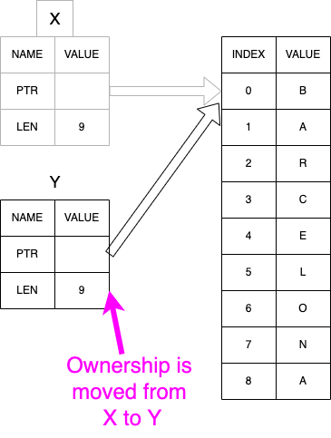

# H1 Benefits of ownership rules
- Avoid to use a garbage collection that regularly looks for no-longer used memory
-   
- Memory Safety:  
- Avoid dangling references
- Avoid race conditions 

# H2 Ownership Rules
1. Each value in Rust has an owner.
2. There can only be one owner at a time.
3. When the owner goes out of scope, the value will be dropped.

// Example 1: Avoid to use a garbage collection that regularly looks for no-longer used memory

```rust
#[test]
fn  ownership_test() {

    let  x = "BARCELLONA".to_string();
    let  y = x;

    let res = format!("word {} has lenght {}", x, x.len());
                                               - value moved here

    assert_eq!(res,"word BARCELLONA has lenght 10")
}

```




// Example 2: Avoid to use a garbage collection that regularly looks for no-longer used memory

```rust
    #[test]
    fn count_words_in_string() {  
      
        let input = String::from("first second");
        let num: usize = words_in(input);

        println!("number of work in {} is {}", input, num);
                                               ^^^^^ value borrowed here after move
        assert_eq!(num, 2);
    }

    fn words_in(input: String) -> usize {
        let split = input.split(" ");
        split.count()
    }
```

// Example 3 

```rust

    struct Product {
        name: String,
        productType: ProductType
    }

    #[derive(PartialEq,Clone)]
    enum ProductType {
        FRUIT,
        DRINK
    }


    #[test]
    fn  count_product_by_type() {
        let products = vec![
            Product { name: "apple".to_string(), productType: FRUIT },
            Product { name: "pear".to_string() , productType: FRUIT },
            Product { name: "mojito".to_string(), productType: DRINK }
        ];

        let  fruits = count_fruits(products);
                                   -------- value moved here
        let  drinks = count_drinks(products);
                                   ^^^^^^^^ value used here after move

        assert_eq!(fruits,2);
        assert_eq!(drinks,1);

    }

```


# H2 The Rules of References
Let’s recap what we’ve discussed about references:

1. At any given time, you can have either one mutable reference or any number of immutable references.  
2. References must always be valid.  
